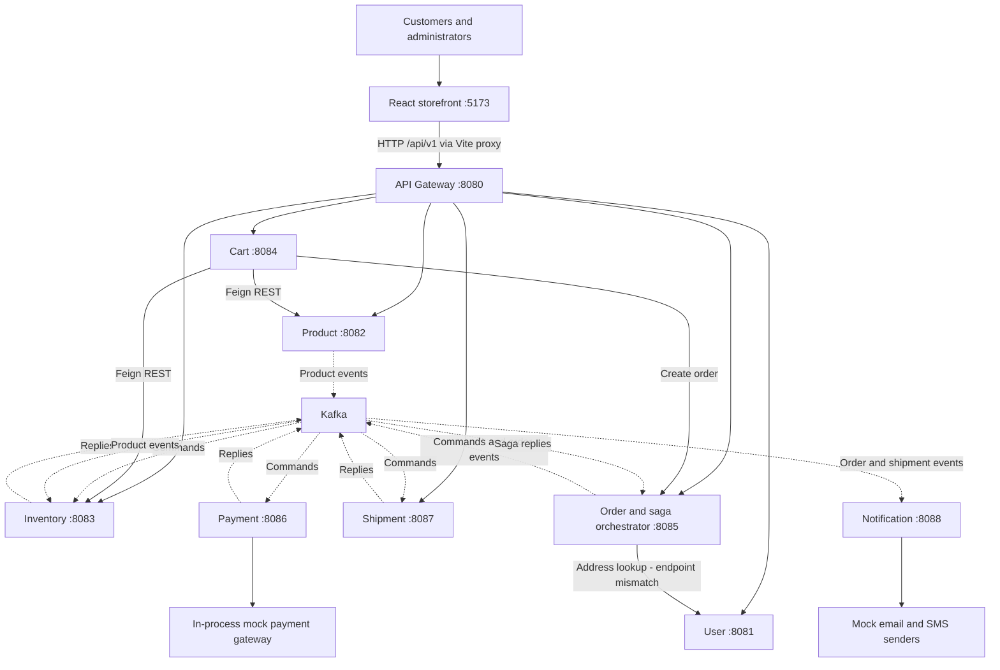
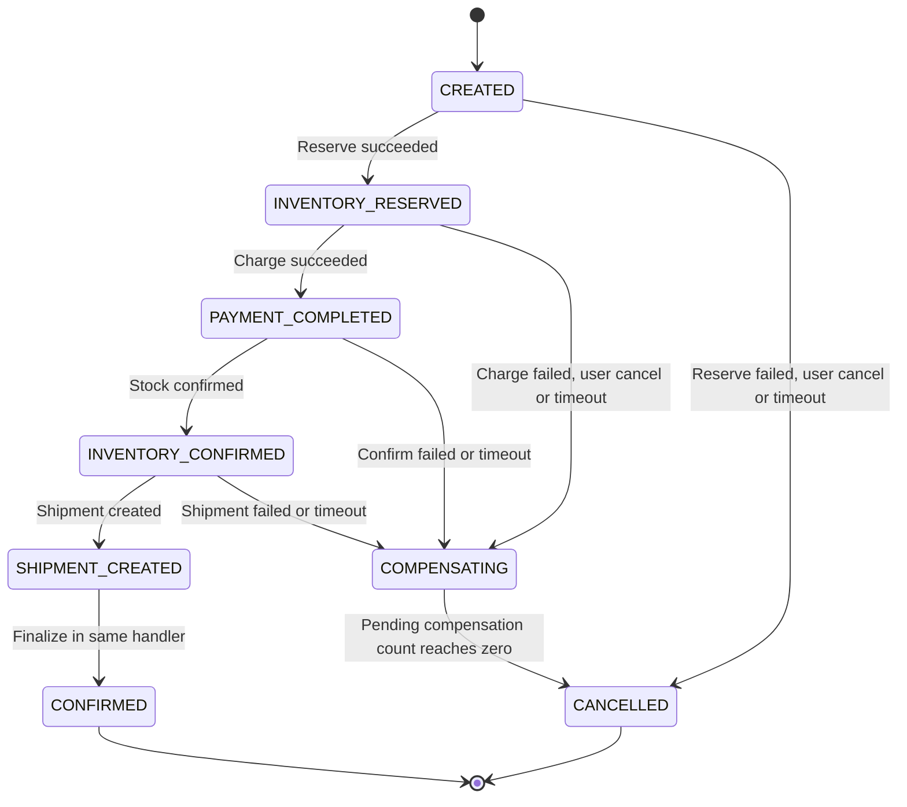
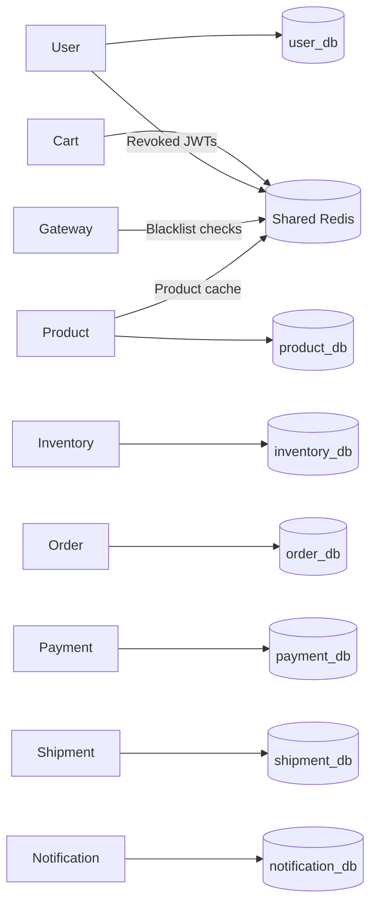

# E-commerce POC — System Architecture

Reviewed: 12 September 2026. This document describes the current working tree, including local changes and the frontend. Source code, SQL and runtime configuration take precedence over the original design notes and service contracts. This is a static architecture review; deployment and failure scenarios have not been executed.

## 1. System overview

The application is a React storefront backed by eight independently packaged Spring Boot business services. A Spring Cloud Gateway handles browser API traffic, while Eureka supplies service discovery. Services use synchronous REST for interactive reads and checkout submission, and Kafka commands/replies for the asynchronous order workflow.

Order Service owns the saga: reserve inventory → charge payment → confirm inventory → create shipment → confirm order. Notification Service observes the resulting events. Each SQL-backed service owns a separate database, although all seven databases share one PostgreSQL container. Cart Service stores its primary data in Redis.



Solid arrows represent HTTP or local calls. Dashed arrows represent asynchronous Kafka traffic. Persistence and discovery are separated below to keep this view readable. Payment and Notification have REST controllers but no gateway routes.

## 2. Technology and component responsibilities

| Component | Implementation | Responsibility |
|---|---|---|
| Frontend | React 19, TypeScript, Vite 8 | Catalog, authentication, cart, checkout, order timeline, tracking, profile and administration |
| UI and state | React Router, TanStack Query, Zustand, Axios, Tailwind, Radix UI | Lazy page loading, server data caching, local auth/cart state, HTTP transport and UI components |
| Backend | Java 21, Spring Boot 3.2.5, Spring Cloud 2023.0.1, Maven | Separate executable application and Docker image for each service |
| Gateway | Spring Cloud Gateway, reactive Redis, JWT, Resilience4j | Explicit routes, authentication, token revocation checks and fallback responses |
| Discovery | Eureka Server :8761 | Registration and name resolution for gateway `lb://` routes and Feign clients |
| Persistence | PostgreSQL 16, Spring Data JPA/Hibernate | Seven service-owned databases; SQL initializes schema and Hibernate validates it |
| Shared Redis | Redis 7 :6379 | Cart storage, individual-product cache and access-token blacklist |
| Messaging | Kafka 3.7, single broker in KRaft mode | Product events, saga commands/replies and notification triggers |
| Local operations | Docker Compose, Actuator, Springdoc, Kafka UI :8090 | Infrastructure orchestration, health/metrics, API documentation and message inspection |

Versions above come from checked-in manifests, not a claim about current upstream versions.

| Business service | Port | Owned data | Main behavior |
|---|---:|---|---|
| User | 8081 | Users, roles, addresses, refresh tokens | Registration/login, JWT issuance, refresh rotation, logout and profiles |
| Product | 8082 | Products, categories, outbox | Catalog search/filtering, admin product mutation, soft deletion and product events |
| Inventory | 8083 | Stock, reservations, processed events, outbox | Availability, admin stock updates, reserve/confirm/release, optimistic version checks |
| Cart | 8084 | Redis cart hashes | Quantity management, live price enrichment, availability checks and order submission |
| Order | 8085 | Orders/items/history, idempotency keys, processed events, outbox | Order creation/reads/cancellation, saga state machine and timeout handling |
| Payment | 8086 | Payments, transactions, processed events, outbox | Mock charge/refund handling; one payment row per order |
| Shipment | 8087 | Shipments/history, processed events, outbox | Local tracking-number generation, tracking reads and admin status changes |
| Notification | 8088 | Notification log, processed events | Event-driven mock email delivery; email/SMS sender abstraction |

## 3. Frontend and request architecture

`main.tsx` installs BrowserRouter, QueryClient and an error boundary. `App.tsx` defines lazy-loaded public, authenticated and administrator pages. ProtectedRoute uses the auth store for navigation gating; backend security remains responsible for authorization.

Axios uses `/api/v1` as its base URL. Vite proxies `/api` to `http://localhost:8080` in development. Zustand persists access/refresh tokens and user details in browser localStorage. The Axios request interceptor attaches the access token. On a 401, a shared refresh operation queues concurrent failed requests, updates stored tokens and retries requests; refresh failure clears authentication and redirects to login.

TanStack Query defaults to a 30-second stale time and one query retry. The order detail page polls status every three seconds while the order is PENDING, then refreshes the full order and loads shipment data after confirmation. There is no browser Kafka connection or WebSocket status channel.

| Gateway path prefix | Destination | API surface |
|---|---|---|
| `/api/v1/auth/**` | User | Register, login, refresh, logout |
| `/api/v1/users/**` | User | Profile and address operations; user lookup |
| `/api/v1/products/**` | Product | Product list/detail and admin CRUD |
| `/api/v1/categories/**` | Product | Category list/create |
| `/api/v1/inventory/**` | Inventory | Stock, availability and admin stock update |
| `/api/v1/cart/**` | Cart | Read/clear cart, item mutation and checkout |
| `/api/v1/orders/**` | Order | Create, list, detail, status and cancellation |
| `/api/v1/shipments/**` | Shipment | Lookup by order, public tracking and admin status update |

Payment exposes `GET /api/v1/payments/{orderId}` and Notification exposes `GET /api/v1/notifications`, both admin-oriented, directly on their service ports. No gateway route currently exposes them.

### Authentication boundary

The gateway validates JWT signature/expiry and checks `blacklist:{jti}` in Redis. For protected requests it removes Authorization and sets `X-User-Id` and `X-User-Roles`. Business-service filters construct Spring Security authentication from those headers. User Service additionally supports direct Bearer-token validation. Feign interceptors forward identity context between services.

Access tokens expire after 15 minutes; refresh tokens after seven days. Refresh-token hashes are stored in PostgreSQL. Logout writes the access-token JTI into Redis for its remaining lifetime and revokes the refresh token.

Public gateway bypasses cover auth, shipment tracking, actuator/fallback paths and GET product/category paths with trailing slashes. The current prefix checks do **not** exempt exact `/api/v1/products` or `/api/v1/categories` collection paths, even though the frontend uses them for public browsing.

This design assumes trusted internal networking. Compose publishes every service port to the host, and service filters accept identity headers directly. Gateway-only authentication is therefore not an enforced network boundary in this deployment. Public gateway bypasses also do not sanitize incoming identity headers.

## 4. Checkout and order saga

```mermaid
sequenceDiagram
    actor Customer
    participant UI as React UI
    participant G as Gateway
    participant C as Cart
    participant P as Product
    participant I as Inventory
    participant O as Order
    participant U as User
    participant K as Kafka
    participant Pay as Payment
    participant S as Shipment
    participant N as Notification
    Customer->>UI: Checkout with shipping address
    UI->>G: POST cart/checkout + Idempotency-Key
    G->>C: Authenticated request
    C->>C: Read Redis cart
    loop Each item
        C->>P: Get current product price
        C->>I: Check availability
    end
    C->>O: POST orders with price snapshots
    O->>U: Resolve address (current route mismatch)
    U-->>O: Lookup fails; placeholder used
    O->>O: Transaction: order + items + history + outbox + idempotency
    O-->>C: PENDING order
    C->>C: Clear Redis cart
    C-->>G: Order response
    G-->>UI: PENDING order
    Note over O,N: Publishing services use scheduled outbox relays
    O->>K: inventory.reserve.command
    K->>I: Reserve stock
    I->>K: inventory.reserve.reply
    K->>O: Reservation result
    O->>K: payment.charge.command
    K->>Pay: Charge mock gateway
    Pay->>K: payment.charge.reply
    K->>O: Payment result
    O->>K: inventory.confirm.command
    K->>I: Confirm reserved stock
    I->>K: inventory.confirm.reply
    K->>O: Confirmation result
    O->>K: shipment.create.command
    K->>S: Create shipment and tracking number
    S->>K: shipment.create.reply
    K->>O: Shipment result
    K->>N: Shipment notification trigger
    O->>O: Set CONFIRMED
    O->>K: order.confirmed
    K->>N: Confirmation notification trigger
    UI->>G: Poll orders/{id}/status every 3 seconds
    G->>O: Read status
    O-->>UI: Status via gateway
```

The initial inventory availability read is advisory. The asynchronous reserve command performs the stock mutation. Cart deletion occurs after order creation, before saga confirmation; a later cancellation does not restore the cart.

Order creation stores a SHA-256 request hash and cached response under the supplied idempotency key. Same key/body returns the cached response; a different body produces a conflict. The frontend creates a new key each time its checkout function is invoked, so separate user retries do not necessarily deduplicate. A repeat through Cart also has to pass its nonempty-cart check.

Order Service snapshots prices supplied by Cart and attempts to snapshot the shipping address. Its UserClient calls `/users/{userId}/addresses`, but UserController exposes `/users/me/addresses`. The fallback stores `{addressId, resolved:false}` and lets the order proceed. Cart currently omits productName from the order item request, so Order Service uses a generated `Product <id>` label.



| Failure/state | Implemented action |
|---|---|
| Reserve failure / cancellation in CREATED | Cancel directly; emit `order.cancelled` |
| Payment failure / cancellation in INVENTORY_RESERVED | Release inventory; wait for one compensation reply |
| Inventory confirmation or shipment failure | Refund payment and release inventory; wait for two compensation replies |
| Late reply in an unexpected saga state | State guard skips the transition |
| Failed refund/release reply | Log failure and still decrement pending compensation count |

The timeout reaper runs every 30 seconds. CREATED and INVENTORY_RESERVED use a 30-second threshold, PAYMENT_COMPLETED uses 60 seconds, and INVENTORY_CONFIRMED uses 120 seconds. The database query measures age from **order creation**, not entry into the current state. COMPENSATING is not scanned.

## 5. Kafka topology and delivery semantics

| Topic(s) | Producer | Consumer(s) | Purpose |
|---|---|---|---|
| `product.created`, `product.updated` | Product | Inventory | Initialize zero-stock records and react to product changes |
| `inventory.reserve.command` | Order | Inventory | Reserve order quantities |
| `inventory.reserve.reply` | Inventory | Order | Reservation result |
| `payment.charge.command` | Order | Payment | Charge total amount |
| `payment.charge.reply` | Payment | Order | Charge result and payment ID |
| `inventory.confirm.command` | Order | Inventory | Consume reservations |
| `inventory.confirm.reply` | Inventory | Order | Stock confirmation result |
| `shipment.create.command` | Order | Shipment | Create local shipment |
| `shipment.create.reply` | Shipment | Order, Notification | Shipment result and tracking number |
| `inventory.release.command`, `inventory.release.reply` | Order / Inventory respectively | Inventory / Order respectively | Inventory compensation |
| `payment.refund.command`, `payment.refund.reply` | Order / Payment respectively | Payment / Order respectively | Payment compensation |
| `order.confirmed`, `order.cancelled` | Order | Notification | Terminal order notifications |
| `user.registered` | **No implemented publisher** | Notification | Welcome-message consumer exists; User Kafka auto-configuration is disabled |

Envelopes contain eventId, eventType, aggregateId, timestamp and payload; saga messages also carry sagaId. Saga records use orderId as the Kafka key. This provides partition affinity within each topic, not a total order across topics. Order and Notification have separate consumer groups, so both can receive shipment replies.

Product, Inventory, Order, Payment and Shipment write outbox records alongside local business changes. Their scheduled relays poll at 500 ms intervals in batches of up to 100. Consumers use `processed_event` tables and local transactions to support duplicate detection. Outbox repositories use pessimistic locking with a skip-locked hint.

The code does **not** yet establish reliable exactly-once processing:

- Relays call asynchronous `KafkaTemplate.send()` and mark rows published without waiting for the returned future. A later send failure can leave a published row with no delivered message.
- Relays generate a new eventId for every publication attempt, so replay of the same outbox row does not preserve its deduplication identity.
- Listener factories use MANUAL_IMMEDIATE acknowledgement; handlers acknowledge inside transaction-annotated methods, before the transaction interceptor commits. Database changes and offsets are not atomically committed.
- Malformed envelopes are logged and acknowledged. No explicit dead-letter/replay pipeline was found in the Kafka configurations.

## 6. Data ownership and persistence



All seven database nodes reside in one PostgreSQL instance. Ownership is logical: services share the configured PostgreSQL account, so database permissions do not independently enforce these boundaries. Cross-service references are UUID values, not cross-database foreign keys or joins.

| Database/store | Tables or keys | Relationships and constraints |
|---|---|---|
| user_db | users, roles, user_roles, addresses, refresh_tokens | User has many addresses/tokens; many-to-many roles; unique email/token hash |
| product_db | categories, products, outbox_event | Category self-parent relation; products reference categories; nonnegative price |
| inventory_db | stock_items, stock_reservations, processed_event, outbox_event | Stock keyed by productId; version for optimistic locking; reservations reference order/product IDs logically |
| order_db | orders, order_items, order_status_history, idempotency_keys, processed_event, outbox_event | Order owns items/history; unique order idempotency key; address JSONB and price snapshots |
| payment_db | payments, transactions, processed_event, outbox_event | Unique orderId per payment; payment owns charge/refund transactions |
| shipment_db | shipments, shipment_events, processed_event, outbox_event | Unique orderId per shipment; shipment owns status history |
| notification_db | notification_log, processed_event | Persisted delivery outcome and event deduplication |
| Redis | `cart:{userId}`, `product:{id}`, `blacklist:{jti}` | Cart hash maps product IDs to quantities; seven-day cart TTL; ten-minute product cache; blacklist TTL matches remaining JWT lifetime |

The schema source is `api , db and kafka contracts/db-init.sql`. It runs on initial PostgreSQL volume creation; Hibernate uses `ddl-auto: validate`. This is not an incremental migration mechanism. The root `db-init.sql` directory is not the mounted initialization script.

## 7. Deployment and internal structure

Compose defines 14 containers: PostgreSQL, Redis, Kafka, Kafka UI, Eureka, Gateway and eight business services. They share the `ecommerce-net` bridge. The frontend is run separately with Vite; it has no Compose service. Production SPA hosting and `/api` reverse proxy configuration are not supplied by this deployment.

Every Java component has its own Maven POM and a multistage Dockerfile, with a Java 21 JRE and non-root runtime user. Docker image builds skip tests. PostgreSQL has the named `pgdata` volume; Redis and Kafka have no explicit persistent data volumes in Compose. Infrastructure health checks gate selected startup dependencies, but do not prove that every application dependency is ready.

| Connection | Within Docker | From host |
|---|---|---|
| PostgreSQL | `postgres:5432` | `localhost:5432` |
| Redis | `redis:6379` | `localhost:6379` |
| Kafka | `kafka:9092` | `localhost:9093` |
| Eureka | `eureka-server:8761/eureka` | `localhost:8761/eureka` |
| Browser API | Gateway service port 8080 | `localhost:8080` via Vite proxy |

Host-run Kafka clients should set `SPRING_KAFKA_BOOTSTRAP_SERVERS=localhost:9093`. Application YAML defaults to localhost:9092, whose advertised broker address is intended for Docker networking.

Most business services follow Controller → Service → Repository → JPA Entity, with DTOs, mappers, security configuration and exception handling. Kafka consumers call transactional services; scheduled outbox relays publish pending events. Cart substitutes a Redis repository and Feign clients for JPA. Order adds SagaOrchestrator and SagaTimeoutReaper. Payment and Notification have mock integration adapters. There is no shared Java domain library; envelope and infrastructure patterns are repeated in service modules.

Resilience4j is used on gateway routes, Feign dependencies and the mock payment adapter. Fallbacks include degraded product enrichment, unavailable inventory, order submission failure and unresolved shipping addresses. Configuration values differ across layers: the gateway time limiter is 10 seconds while Cart YAML specifies 60 seconds for its clients. Annotation presence and configuration do not by themselves prove all runtime timeout behavior.

Actuator, logs and Springdoc provide local diagnostics. Kafka UI allows broker inspection. No deployed metrics scraper/dashboard, distributed tracing backend, schema registry, Kubernetes configuration or CI workflow was found in the reviewed project.

## 8. Important implementation gaps

These are source-observed limitations of the current architecture, not changes made by this documentation task.

| Area | Observation | Architectural consequence / next step |
|---|---|---|
| Event durability | Async sends marked published early; event IDs regenerated | Await broker acknowledgement and reuse durable outbox IDs; validate crash/replay behavior |
| Consumer commit ordering | Immediate acknowledgement inside DB transactions | Coordinate acknowledgement after successful commit and test redelivery |
| Stock compensation | Release selects only RESERVED rows, while shipment occurs after stock becomes CONFIRMED | Shipment failure cannot restore already-confirmed stock through the current release implementation |
| Saga cancellation races | CREATED already has a reserve command queued; direct cancellation does not retract it | Late reserve/payment effects need reconciliation and explicit compensations |
| Compensation completion | Failed replies decrement the counter; COMPENSATING has no timeout scan | CANCELLED does not prove stock and money were restored |
| Address contract | UserClient calls a nonexistent address-list route | Orders proceed with unresolved address snapshots; align client/controller contracts |
| Order trust | Creation consumes userId and prices from the request; route is gateway-accessible | Enforce caller ownership and trusted price calculation or restrict creation to Cart |
| Network trust | Service ports exposed; services trust identity headers | Restrict ingress and establish authenticated service identity before external deployment |
| Public catalog routing | Exact collection paths miss the gateway public-prefix checks | Anonymous listing can be rejected despite public frontend routes |
| External integrations | Payment and email/SMS mocked; shipment generated locally | No real charge, carrier booking or delivery occurs |
| Notifications | No registration publisher; order recipients are placeholders | Welcome flow is disconnected; real recipient resolution is absent |
| Checkout retries | Fresh frontend keys and cart cleared before saga finishes | Retry/recovery needs a durable checkout identity and explicit UX |
| Redis availability | Product cache read/eviction exceptions are not universally caught | Redis is an availability dependency for those paths, despite comments describing graceful fallback |
| Persistence/scaling | One broker/PostgreSQL/Redis; fixed service container names/ports | Local POC topology provides no configured high availability or straightforward replica scaling |

Prioritize delivery/commit correctness, complete compensation, address and trust contracts, then real integration adapters and operational deployment. These improvements preserve the overall service boundaries while making the existing workflow dependable.

## 9. Source map

Paths below are relative to the repository root and identify the implementation anchors for maintaining this document.

| Architecture area | Primary sources |
|---|---|
| Deployment and schema | `docker-compose.yml`; `api , db and kafka contracts/db-init.sql`; each service's Dockerfile, POM and application.yml |
| Browser and state | `ecomm-frontend/src/main.tsx`, `App.tsx`, `api/axios.ts`, `api/cart.ts`, `stores/`, `pages/OrderDetailPage.tsx`; `vite.config.ts` |
| Gateway | `api-gateway/src/main/resources/application.yml`; `src/main/java/com/ecomm/gateway/filter/JwtAuthenticationFilter.java` |
| Authentication | `user-service/src/main/java/com/ecomm/user/service/AuthService.java`; `config/JwtFilter.java`; `controller/UserController.java` |
| Catalog/cache | `product-service/src/main/java/com/ecomm/product/service/ProductService.java`; `config/SecurityConfig.java` |
| Cart orchestration | `cart-service/src/main/java/com/ecomm/cart/service/CartService.java`; `client/`; `repository/CartRedisRepository.java` |
| Saga/state/timeouts | `order-service/src/main/java/com/ecomm/order/service/OrderService.java`, `SagaOrchestrator.java`, `SagaTimeoutReaper.java`; `kafka/SagaReplyConsumer.java`; `repository/OrderRepository.java`; `client/UserClient.java` |
| Inventory transitions | `inventory-service/src/main/java/com/ecomm/inventory/service/SagaInventoryService.java`; `kafka/ProductEventConsumer.java` |
| Payment adapter | `payment-service/src/main/java/com/ecomm/payment/service/PaymentService.java`; `gateway/MockPaymentGateway.java` |
| Shipment | `shipment-service/src/main/java/com/ecomm/shipment/kafka/ShipmentCommandConsumer.java`; `service/ShipmentService.java` |
| Notifications | `notification-service/src/main/java/com/ecomm/notification/kafka/OrderEventConsumer.java`, `UserEventConsumer.java`; `sender/` |
| Delivery mechanics | Publishing services' `service/OutboxRelayService.java` and `repository/OutboxEventRepository.java`; consuming services' `config/KafkaConfig.java` |
| Original intent | `claude design.md`; `api , db and kafka contracts/api-contracts.md`, `event-catalog.md`; service contract JSON files |
